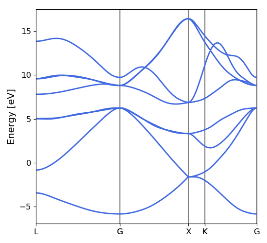
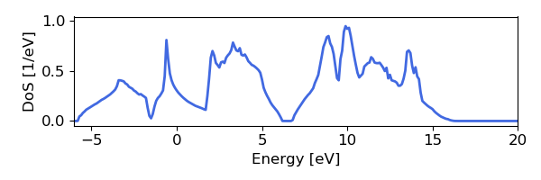

.. _bands:

Basic Band Structure and DoS 
==============================

Synopsis
--------

In addition to transport and lifetime calculations, Phoebe can also perform basic band structure and density of states calculations. These can be useful when debugging a calculation or checking the quality of a Wannier or Fourier interpolation. The quality of interpolation is often dependent on the number of k or q points used in DFT, so sometimes it can be helpful to run this calculation to ensure that your DFT calculation used a dense enough mesh. 

Step 1: Generate input files
--------------------------------------

For this short tutorial, we're going to use Quantum Espresso output files for electrons, and phono3py output for phonons, as generated from one of the other tutorials. 

Before performing this calculation, you should either run steps 1-3 of the :ref:`elWanTransport` or steps 1-3 of the :ref:`phononTransport`. The input files necessary for the electron and phonon bands calculations are:

.. raw:: html

  <h4>Electron Wannier input files</h4>

* si_tb.dat

.. raw:: html

  <h4>Electron Fourier input files</h4>

* silicon.xml

.. raw:: html

  <h4>Phonon input files (Quantum Espresso)</h4>

* silicon.fc

.. raw:: html

  <h4>Phonon input files (phono3py)</h4>

* fc2.hdf5
* phono3py_disp.yaml (or phonopy_disp.yaml harmonic only)
* disp_fc3.yaml (or disp.yaml if harmonic only)

After running at least the necessary steps of these prior calculations and copying this output into your current directory (or at least, noting the path to the files so that you can specify it in the below input files), we can proceed to the next step. 

Step 2: Using Phoebe to calculate band structure
-----------------------------------------------------

Once we have the necessary input files, we run Phoebe using one of the input files below, which are also available in either ``example/Silicon_el/electronWannierBands.in``, ``example/Silicon_epa/electronFourierBands.in`` or ``example/Silicon_ph/phononBands.in``.

.. raw:: html

  <h4>Electron Wannier bands input file</h4>

::

  appName = "electronWannierBands"
  electronH0Name = "si_tb.dat"
  deltaPath = 0.1
  useSymmetries = true

  begin point path
  L 0.50000  0.50000 0.5000 G 0.00000  0.00000 0.0000
  G 0.00000  0.00000 0.0000 X 0.50000  0.00000 0.5000
  X 0.50000 -0.50000 0.0000 K 0.37500 -0.37500 0.0000
  K 0.37500 -0.37500 0.0000 G 0.00000  0.00000 0.0000
  end point path

  begin crystal
  Si 0.000000000   0.000000000   0.000000000
  Si 1.349401887   1.349401887   1.349401887
  end crystal

.. raw:: html

  <h4>Electron Fourier bands input file</h4>

::

  appName = "electronFourierBands"
  electronH0Name = "silicon.xml"
  deltaPath = 0.1
  electronFourierCutoff = 4.
  useSymmetries = true

  begin point path
  L 0.50000  0.50000 0.5000 G 0.00000  0.00000 0.0000
  G 0.00000  0.00000 0.0000 X 0.50000  0.00000 0.5000
  X 0.50000 -0.50000 0.0000 K 0.37500 -0.37500 0.0000 
  K 0.37500 -0.37500 0.0000 G 0.00000  0.00000 0.0000
  end point path

.. raw:: html

  <h4>Phonon bands input file</h4>

::

  phFC2FileName = "silicon.fc" 
  sumRuleFC2 = "simple"
  appName = "phononBands"
  useSymmetries = true

  begin point path
  L 0.50000  0.50000 0.5000 G 0.00000  0.00000 0.0000
  G 0.00000  0.00000 0.0000 X 0.50000  0.00000 0.5000
  X 0.50000 -0.50000 0.0000 K 0.37500 -0.37500 0.0000 
  K 0.37500 -0.37500 0.0000 G 0.00000  0.00000 0.0000
  end point path

**when using phono3py, the** ``phFC2FileName`` **line should be replaced by three input variables instead**::

  phFC2FileName = "fc2.hdf5"
  phonopyDispFileName = "phono3py_disp.yaml"
  dispFCFileName = "disp_fc3.yaml"

As we can see, these input files are relatively similar. We briefly describe the relevant input parameters below:

* :ref:`appName`: we set this to ``electronWannierBands``, ``electronFourierBands``, or ``phononBands`` to tell Phoebe to run the app to generate the band structure of choice.

* :ref:`phFC2FileName`: in the phonon cases, this file should point to the harmonic phonon input file, whether from QE or phono3py.

* :ref:`sumRuleFC2`: tells Phoebe to use either the simple or crystal acoustic sum rule for the harmonic phonons.

* :ref:`electronH0Name`: used for the electronic case, this points to the ``*_tb.dat`` file from Wannier90.

* :ref:`deltaPath`: this parameter specifies the spacing of points along the band path. Smaller values will give a band path along a finer wavevector path.

* :ref:`electronFourierCutoff`: this parameter specifies the cutoff size of the supercell used in the Fourier interpolation process. The calculation expense scales as :math:`N^3` for this parameter, and you will only see improvement up to a certain point. 

* :ref:`useSymmetries`: this turns on the use of symmetries in Phoebe, which can speed up the calculation. 

* The ``begin crystal`` and ``end crystal`` block is used to provide the crystal structure used in the Wannier90 calculation in crystal coordinates, as this information is not stored in the tb.dat file. 

* Finally, the ``begin point path`` and ``end point path`` specify the band path along which we will calculate the lifetimes.

Once we have the files collected in step 1, and one of the corresponding input files as shown above, we can now run this calculation with Phoebe, replacing the input file in the line below with whichever you'd like to use::

  export OMP_NUM_THREADS=4
  mpirun -np 1 /path/to/phoebe/build/phoebe -in electronWannierBands.in

These apps are well parallelized over OMP threads or MPI processes, so set the above parameters to match your system architecture accordingly.

Step 3: Using Phoebe to calculate DoS
-----------------------------------------------------

We can also use these inputs to run a DoS calculation, as shown in example files ``example/Silicon_el/electronWannierDos.in``, ``example/Silicon_epa/electronFourierDos.in`` or ``example/Silicon_ph/phononDos.in``.

.. raw:: html

  <h4>Electron Wannier DoS input file</h4>

::

  electronH0Name = "si_tb.dat"
  kMesh = [10,10,10]
  appName = "electronWannierDos"
  dosMinEnergy = -6. eV
  dosMaxEnergy = 20. eV
  dosDeltaEnergy = 0.1 eV
  useSymmetries = true

  begin crystal
  Si 0.000000000   0.000000000   0.000000000
  Si 1.349401887   1.349401887   1.349401887
  end crystal

.. raw:: html

  <h4>Electron Fourier DoS input file</h4>

::

  electronH0Name = "silicon.xml"
  kMesh = [10,10,10]
  appName = "electronFourierDos"
  dosMinEnergy = -6. eV
  dosMaxEnergy = 20. eV
  dosDeltaEnergy = 0.1 eV
  electronFourierCutoff = 4.
  useSymmetries = true

.. raw:: html

  <h4>Phonon DoS input file</h4>

::

  phFC2FileName = "silicon.fc",
  sumRuleFC2 = "simple"
  qMesh = [10,10,10]
  appName = "phononDos"
  dosMinEnergy = 0. cmm1
  dosMaxEnergy = 600. cmm1
  dosDeltaEnergy = 0.5 cmm1
  useSymmetries = true

As we can see, these input files are all pretty much the same. We briefly describe the relevant input parameters below (without repeating those already defined in the bands step above): 

* :ref:`appName`: we set this to ``electronWannierDos``, ``electronFourierDos``, or ``phononDos`` to tell Phoebe to run the app to generate the band structure of choice.

* :ref:`qMesh` or :ref:`kMesh`: for the phonon and electron cases, respectively, these variables specify the fine mesh of points used to calculate the DoS. 

* :ref:`dosMinEnergy` and :ref:`dosMaxEnergy`: these parameters define the minimum and maximum energies for which the DoS is calculated. 

* :ref:`dosDeltaEnergy`: specifies the increment size in energy for which the DoS will be calculated. 

Again using the files set up in step 1, we can run the DoS calculation using the input file of our choice::

  export OMP_NUM_THREADS=4
  mpirun -np 1 /path/to/phoebe/build/phoebe -in electronWannierDoS.in

These apps are well parallelized over OMP threads or MPI processes, so set the above parameters to match your system architecture accordingly.

Output
------

As usual, there are two kinds of output: the standard output, which is printed to the command line in the above run (or could be piped to a text file by appending ``> outfile.out`` to the run line), and the JSON files containing the band path, DoS, and energy information for plotting.

In this case, the standard output doesn't have much output information beyond reporting the calculation progress, so we skip to discussing the JSON output files.

.. raw:: html

  <h4>JSON Output Files</h4>

There are several JSON files output by this calculation. To see how to generically open and view the contents of these files in a python script, you can learn more in the :ref:`postprocessing` section.

**Files which are output during this calculation:**

Here, ``*`` can be either ``electron`` or ``phonon`` depending on the particle type.

* ``*_bands.json``: contains the band path, labels and energies.
* ``*_dos.json``: contains the lifetimes and linewidths on the specified path, for whatever number of temperatures/dopings were specified.

Post-Processsing
-----------------

We provide a post-processing example python script for this calculation in ``scripts/plotScripts/bands.py`` or ``scripts/plotScripts/dos.py``. To run this script, we need to specify the location of one of the JSON files listed above, like this::

  # for the band structure
  python bands.py electron_bands.json
  # for the dos
  python dos.py electron_dos.json

This script will generate the following images, as below for the electron bands and DoS of silicon, found using Wannier interpolation (and a slightly more converged input calculation):

Convergence Checklist
----------------------

As always, this is a demo calculation. However, it's a very simple one, and there are only a few parameters which affect the end calculation. 

* The convergence of your electronic and phonon DFT calculations is of course, critical to this calculation (energy cutoff, k/q mesh, etc). 

* **In particular, the electron Fourier interpolation can need many k-points to converge effectively.** This is not a limitation of Phoebe -- simply, Fourier interpolation requires many points to reach a high quality replication of the electronic structure. 

* You also should converge the DoS with respect to the kMesh/qMesh sampling of the Phoebe calculation.

Parallelization
----------------

The bands and DoS applications can take advantage of both OMP and MPI parallelization very effectively, and you should get an significant performance benefit from using either (or both) of these parameters.
