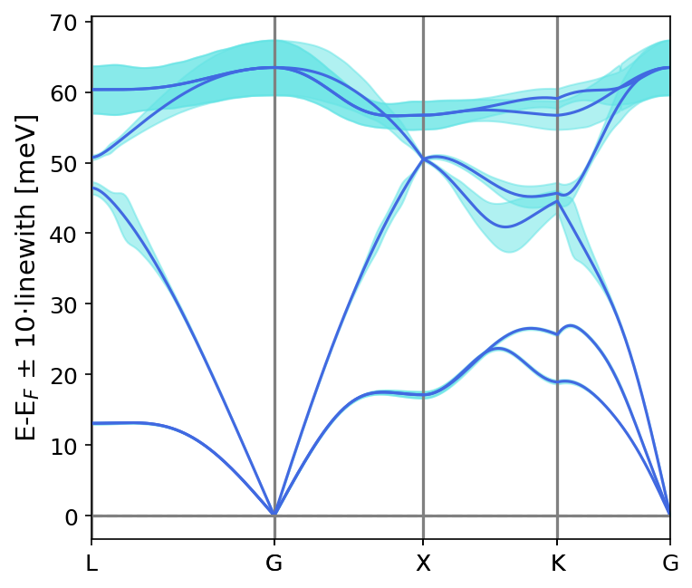
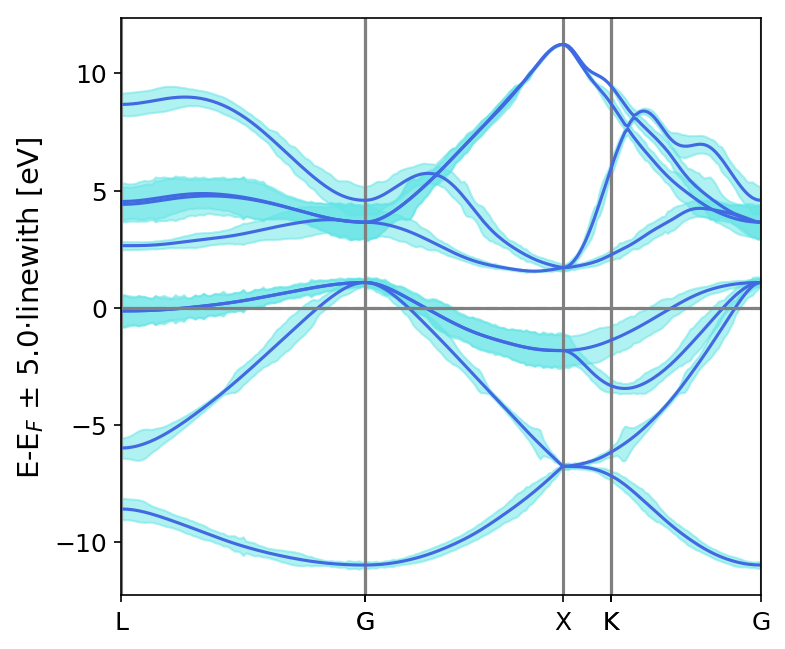
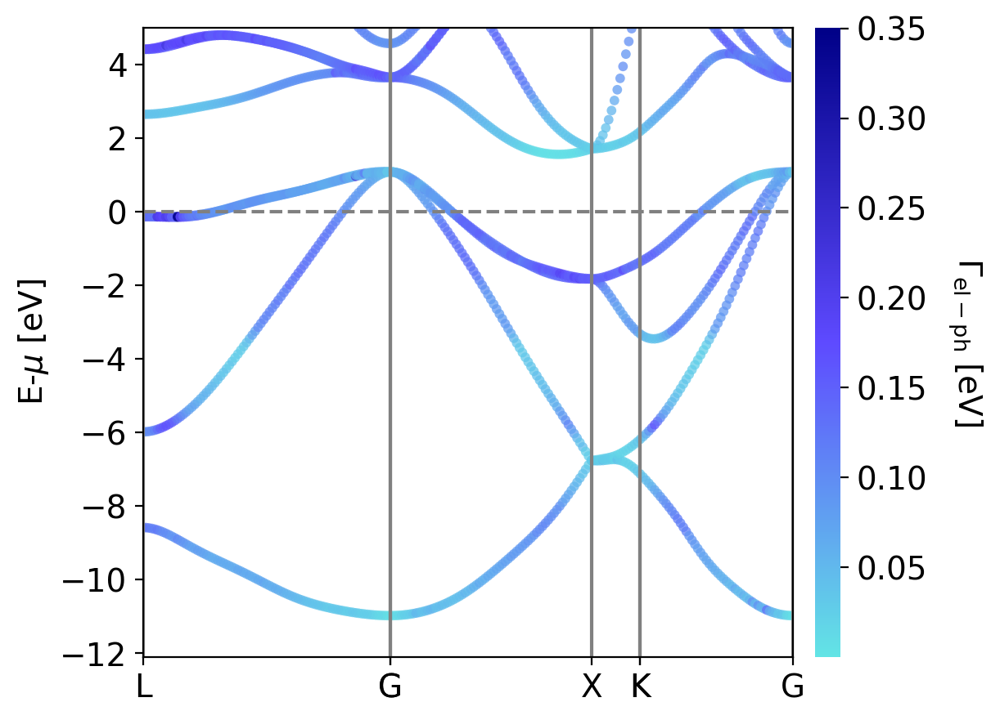

.. _lifetimes:

Linewidths Along a Band Path
=====================================

Synopsis
--------

In this brief tutorial, we will compute the electron and phonon lifetimes along high symmetry paths through the Brillioun zone, to be plotted on the related electron/phonon band structures.

The lifetimes output by this script are calculated within the relaxation time approximation (RTA).

Step 1: Generate coupling input files
--------------------------------------

First, we need to generate the coupling input files to be used to calculate the electron or phonon lifetimes. We'll again show how this works for the case of silicon, so that we can use the output of prior tutorials.

Before performing this calculation, you should either run steps 1-7 of the :ref:`elWanTransport` or steps 1-3 of the :ref:`phononTransport`. The input files necessary for the electron and phonon bands calculations are:

.. raw:: html

  <h4>Electron input files</h4>

* silicon.fc
* si_tb.dat
* silicon.phoebe.elph.hdf5

.. raw:: html

  <h4>Phonon input files</h4>

* fc3.hdf5
* fc2.hdf5
* phono3py_disp.yaml

**or, if using ShengBTE/thirdOrder.py instead of phono3py with Quantum ESPRESSO force constants:**

* silicon.fc
* FORCE_CONSTANTS_3RD

**or, if using ShengBTE/thirdOrder.py instead of phono3py with phonopy force constants:**

* force_constants.hdf5
* phonopy_disp.yaml
* FORCE_CONSTANTS_3RD

If you've run either one of these calculations, you can simply copy these files into your current directory, or point the Phoebe input file from the next step to their location. If you haven't run one of these tutorials, we recommend you do so in the interest of understanding the process -- however, you could also obtain these files by running either ``runMe.sh`` in either ``example/Silicon_el/qe-elph/`` or ``example/Silicon_ph/qe-phonons/`` and ``example/Silicon_ph/qe-ph-anharmonic/``.

Silicon could of course be replaced with the appropriate prefix for any material you want to calculate, for which you have the equivalent files prepared.

Step 2: Phoebe calculation of lifetimes along a path
-----------------------------------------------------

Once we've collected the files from a prior tutorial, we can go ahead and run the Phoebe calculation using the input file below, as found in either ``example/Silicon_el/electronLifetimes.in`` or ``example/Silicon_ph/phononLifetimes.in``.

.. raw:: html

  <h4>Electron lifetimes input file</h4>

::

  appName = "electronLifetimes"

  phFC2FileName = "qe-elph/silicon.fc",
  sumRuleFC2 = "simple"
  electronH0Name = "qe-elph/si_tb.dat",
  elphFileName = "qe-elph/silicon.phoebe.elph.hdf5"

  kMesh = [5,5,5]
  temperatures = [600.]
  dopings = [1.e22]

  smearingMethod = "gaussian"
  smearingWidth = 0.5 eV

  deltaPath = 0.1

  begin point path
  L 0.50000  0.50000 0.5000 G 0.00000  0.00000 0.0000
  G 0.00000  0.00000 0.0000 X 0.50000  0.00000 0.5000
  X 0.50000 -0.50000 0.0000 K 0.37500 -0.37500 0.0000
  K 0.37500 -0.37500 0.0000 G 0.00000  0.00000 0.0000
  end point path

.. raw:: html

  <h4>Phonon lifetimes input file</h4>

::

  appName = "phononLifetimes"

  phFC2FileName = "qe-phonons/silicon.fc",
  sumRuleFC2 = "simple"
  phFC3FileName = "qe-ph-anharmonic/FORCE_CONSTANTS_3RD"

  qMesh = [10,10,10]
  temperatures = [600.]

  smearingMethod = "gaussian"
  smearingWidth = 10. cmm1

  deltaPath = 0.1

  begin point path
  L 0.50000  0.50000 0.5000 G 0.00000  0.00000 0.0000
  G 0.00000  0.00000 0.0000 X 0.50000  0.00000 0.5000
  X 0.50000 -0.50000 0.0000 K 0.37500 -0.37500 0.0000
  K 0.37500 -0.37500 0.0000 G 0.00000  0.00000 0.0000
  end point path

As we can see, these input files are relatively similar. We briefly describe the relevant input parameters below:

* :ref:`appName`: we set this to ``electronLifetimes`` or ``phononLifetimes`` to tell Phoebe to run the app to generate lifetimes on a path.

* :ref:`phFC2FileName`: in both the electron and phonon cases, this file should point to the harmonic phonon input file, whether from QE or phono3py.

* :ref:`sumRuleFC2`: tells Phoebe to use either the simple or crystal acoustic sum rule for the harmonic phonons.

* :ref:`electronH0Name` and :ref:`elphFileName`: used for the electronic case, these point to the ``*_tb.dat`` file from Wannier90 and the ``*.phoebe.elph.hdf5`` file created by the ``qeToPhoebe`` app, respectively.

* :ref:`phFC3FileName`: used for the phonon case, this points to the anharmonic phonon input file from ShengBTE or phon3py.

* :ref:`qMesh` or :ref:`kMesh`: for the phonon and electron cases, respectively, these variables specify the fine mesh of points used to calculate either the phonon or electrons scattering rates output by this calculation. You should converge against this value.

* :ref:`temperatures` and :ref:`dopings`: these lists specify the list of temperatures and doping values for which the lifetimes will be calculated. (Of course, the dopings parameter is not relevant in the phonon case.)

* :ref:`smearingMethod` and :ref:`smearingWidth`: select the adaptive Gaussian or Gaussian smearing methods. If using the Gaussian smearing method, you must also specify the :ref:`smearingWidth` and converge the calculate with repeatedly smaller values of this parameter.

* :ref:`deltaPath`: this parameter specifies the spacing of points along the band path. Smaller values will give a band path along a finer wavevector path.

* Finally, the ``begin point path`` and ``end point path`` specify the band path along which we will calculate the lifetimes.

Once we have the files collected in step 1, and one of the corresponding input files as shown above, we can now run this calculation with Phoebe. We do so with the following command, where ``lifetimes.in`` should be replaced by either ``electronLifetimes.in`` and ``phononLifetimes.in`` from above::

  export OMP_NUM_THREADS=4
  mpirun -np 1 /path/to/phoebe/build/phoebe -in lifetimes.in

This app can be parallelized over OMP threads or mpi processes, so set the above parameters to match your system architecture accordingly.

Output
------

As usual, there are two kinds of output: the standard output, which is printed to the command line in the above run (or could be piped to a text file by appending ``> outfile.out`` to the run line), and the JSON files containing the lifetime/linewidth and band structure information for plotting.

In this case, the standard output doesn't have much output information beyond reporting the calculation progress, so we skip to discussing the JSON output files.

.. raw:: html

  <h4>JSON Output Files</h4>

There are several JSON files output by this calculation. To see how to generically open and view the contents of these files in a python script, you can learn more in the :ref:`postprocessing` section.

**Files which are output during this calculation:**

Here, ``*`` can be either ``el`` or ``ph`` depending on the particle type.

* ``path_*_bandstructure.json``: contains the band path, labels and energies.
* ``path_*_relaxation_times.json``: contains the lifetimes and linewidths on the specified path, for whatever number of temperatures/dopings were specified.

Post-Processsing
-----------------

We provide a post-processing example python script for this calculation in ``scripts/plotScripts/tau_path.py``. To run this script, we need to specify the location of the two JSON files listed above, like this::

  python tau_path.py path_*_relaxation_times.json path_*_bandstructure.json

This script will generate the following images (the below are for silicon, somewhat better converged):

.. raw:: latex

   \newline

Alternatively, one could use the post-processing script, ``scripts/plotScripts/tau_color_path.py`` (note, for this script you'll need the python package ``mpl_toolkits``.),

.. image:: ../images/colorPhdisp.png
  :width: 45%
  :align: right
  :alt: phonon bands with lifetimes

.. raw:: latex

   \newline

Convergence Checklist
----------------------

In this tutorial we show a demo calculation, which is certainly unconverged. We don't discuss the convergence tests that need to be done for a production/publication quality research project.

**You should make sure to test the convergence of everything associated with** :ref:`elWanTransport` **or** :ref:`phononTransport` **tutorials which were used to generate your input files!**

* Be sure to understand where these files come from, and read carefully the respective convergence sections for those calculations in order to converge this calculation.

**In addition to this, you need to converge the Phoebe portion of this calculation using:**

* Test the convergence of the lifetime/linewidth values with respect to the kMesh/qMesh sampling of the Phoebe calculation.

* Check the convergence of the results with respect to :ref:`smearingWidth`, if :ref:`smearingMethod` = gaussian was used.

Parallelization
----------------

For either electron or phonon band structures, you should check the respective electron or phonon transport tutorials' parallelization sections to see more about how to parallelize the calculation. Most of the same advice will apply to these calculations.

This application can take advantage of both OMP and MPI parallelization, so up to a certain point (largely limited by the kMesh/qMesh choice) you should get performance benefit from using either (or both) of these parameters.
