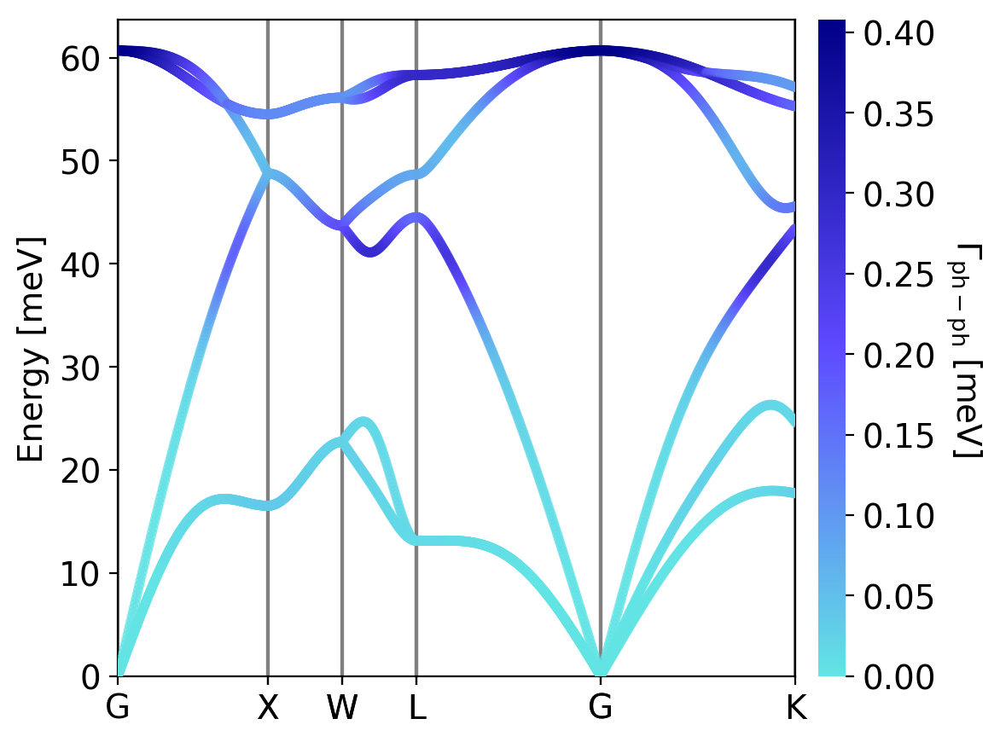
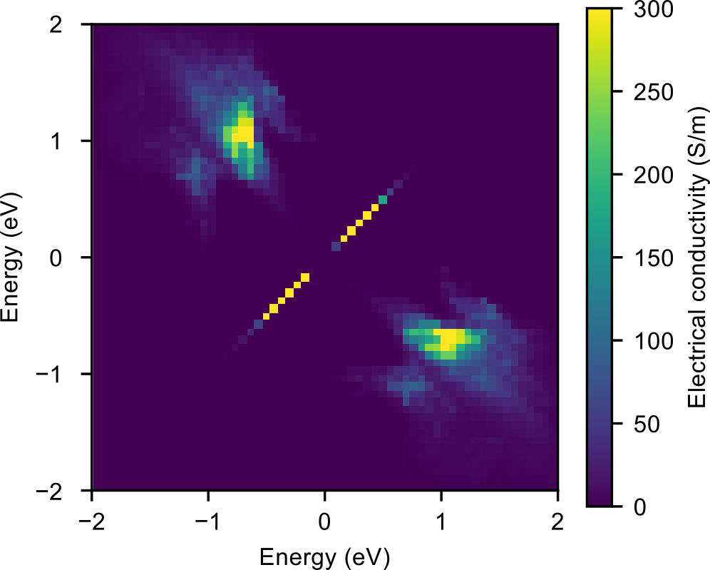
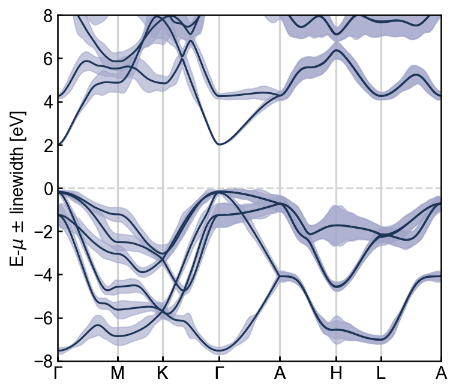
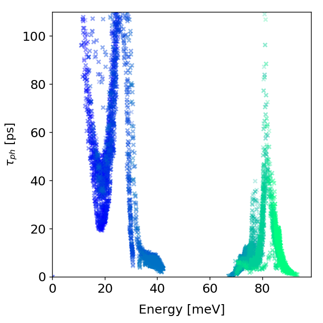
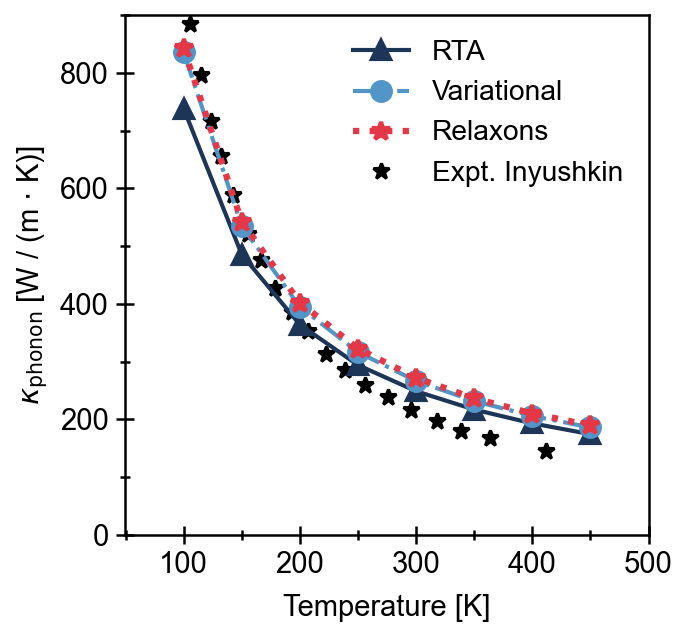

<head>

</head>

<h1> Ab-initio transport, simple and fast.</h1>

Phoebe is an open-source code for the ab-initio computation of electron and phonon transport properties of crystalline materials.

It is designed to take advantage of HPC systems via MPI-OpenMP hybrid parallelism, memory-distributed computing via ScaLAPACK, and GPU accelerated calculation of scattering rates.

  

    
1 / 6

    
  

  

    
2 / 6

    
  

  

    
3 / 6

    
  

  

    
4 / 6

    
  

  

    
5 / 6

    
  

  

    
6 / 6

    
  

  <a class="prev" style="text-decoration: none" onclick="plusSlides(-1)">❮</a>
  <a class="next" style="text-decoration: none" onclick="plusSlides(1)">❯</a>

  

    

  

  

    

      
    

    

      
    

    

      
    

    

      
    

    

      
    

    

      
    

  

 

<h2 style="text-align:left; padding-bottom:0.5em; border-bottom:solid"> Current functionalities</h2>

<h3 style="margin:1em 0 1em 0;">Electronic Transport</h3>
  <ul style="padding-left:2em;">
    <li style="margin: 0 0 0.5em 0;"> Electron-phonon scattering by Wannier interpolation</li>
    <li style="margin: 0 0 0.5em 0;"> Electron-phonon scattering within the electron-phonon averaged (EPA) approximation</li>
    <li style="margin: 0 0 0.5em 0;"> Polar correction and boundary scattering contributions to transport</li>
    <li style="margin: 0 0 0em 0;"> Electronic transport coefficients (mobility, conductivity, thermal conductivity, and Seebeck coefficient)</li>
  </ul>
<h3 style="margin:1em 0 1em 0;">Phonon Transport</h3>
  <ul style="padding-left:2em;">
    <li style="margin: 0 0 0.5em 0;"> 3-phonon scattering from thirdOrder.py/ShengBTE or Phono3py force constants </li>
    <li style="margin: 0 0 0.5em 0;"> Boundary and isotope scattering contributions to transport</li>
    <li style="margin: 0 0 0em 0;"> Phonon (lattice) thermal conductivity</li>
  </ul>
<h3 style="margin:1em 0 1em 0;">And more...</h3>
  <ul style="padding-left:2em;">
    <li style="margin: 0 0 0.5em 0;"> BTE solutions by RTA, iterative, variational, and relaxons solvers</li>
    <li style="margin: 0 0 0.5em 0;"> Calculation of electron and phonon linewidths or relaxation times on a path</li>
    <li style="margin: 0 0 0.5em 0;"> Wigner transport equation correction for electrons and phonons (Zener tunneling contribution to electron transport)</li>
    <li style="margin: 0 0 0.5em 0;"> Hydrodynamic transport properties (viscosity) for electrons and phonons</li>
  </ul>

<h3 style="margin:1em 0 1em 0;"> For the full details of the Phoebe 1.0 release, see:</h3>

Phoebe: a collection of Phonon and Electron Boltzmann Equation solvers. 
A. Cepellotti, J. Coulter, A. Johansson, N. S. Fedorova, B. Kozinsky. 
[arXiv:2111.14999](https://arxiv.org/abs/2111.14999). (2021).

