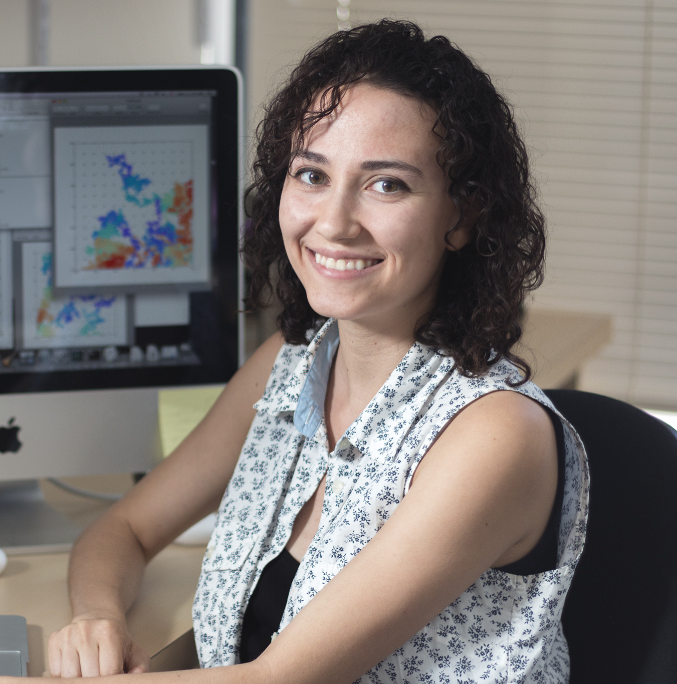
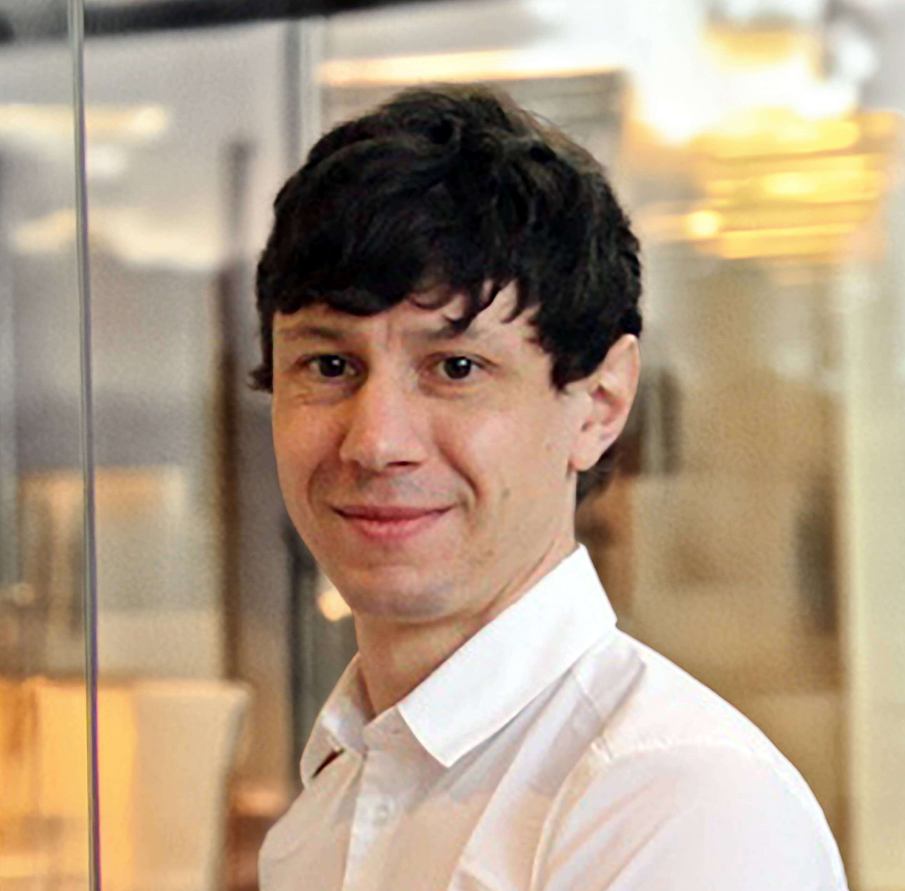
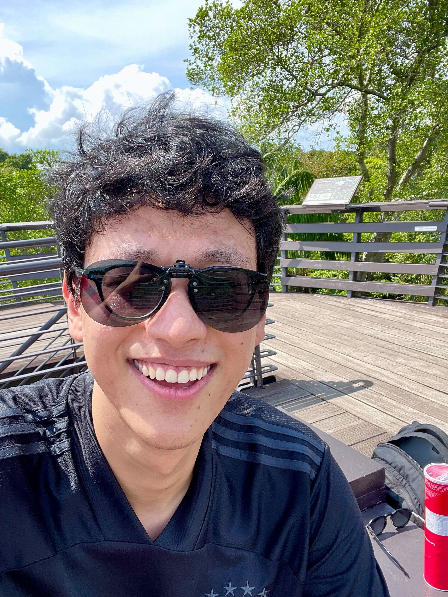

<head>
  <meta name="viewport" content="width=device-width, initial-scale=1">
  <!-- load the CSS of the team pictures grid -->
  <link rel="stylesheet" type="text/css" href="stylesheets/pictureGrid.css" media="screen">
</head>

<h3>Phoebe is maintained by Jenny Coulter, currently at the Flatiron Institute (CCQ), in collaboration with the Kozinsky group at Harvard University and the Simoncelli group at Columbia.</h3>

<h3>Current Developers:</h3>

  

    

      
      

        <h3>Jenny Coulter&thinsp;    
          <a style="text-decoration:none" href="mailto:jcoulter@flatironinstitute.org">
            <i class="fa fa-envelope"></i>
          </a>
        </h3>  
        
 Flatiron Research Fellow
  
        <em>Flatiron Institute, Center for Computational Quantum Physics</em>
      

    

  

  

    

      
      

        <h3>Boris Kozinsky</h3>
        
Gordon McKay Professor of Materials Science and Mechanical Engineering
  
        <em>Harvard University</em>
      

    

  

  

    

      
      

        <h3>Michele Simoncelli</h3>
        
Research Fellow, University of Cambridge
  
        <em>(Incoming faculty at Columbia University)</em>
      

    

  

  

    

      
      

        <h3>Keynesh Dongol</h3>
        
Student Intern
  
        <em>Flatiron Institute, Center for Computational Quantum Physics</em>
      

    

  

  

    

      
      

        <h3>Kamil Iwanowski</h3>
        
PhD Student
  
        <em>University of Cambridge</em>
      

    

  

  

    

      
      

        <h3>Changpeng Lin</h3>
        
PhD Student
  
        <em>EPFL</em>
      

    

  

  

    

      
      

        <h3>Bogdan Rajkov</h3> 
        
PhD Student
  
        <em>University of Cambridge</em>
      

    

  

<h3>Past Contributors:</h3>

  
  

    

      
      

        <h3>Andrea Cepellotti</h3>
        
Research Scientist
  
        <em>Microsoft</em>
      

    

  

  

    

      
      

        <h3>Natalya Fedorova</h3> 
        
Junior R&T Associate
  
        <em>Luxembourg Institute of Science and Technology</em>
      

    

  

  

    

      
      

        <h3>Anders Johansson</h3> 
        
Postdoctoral Researcher
  
        <em>Sandia National Laboratory</em>
      

    

  

